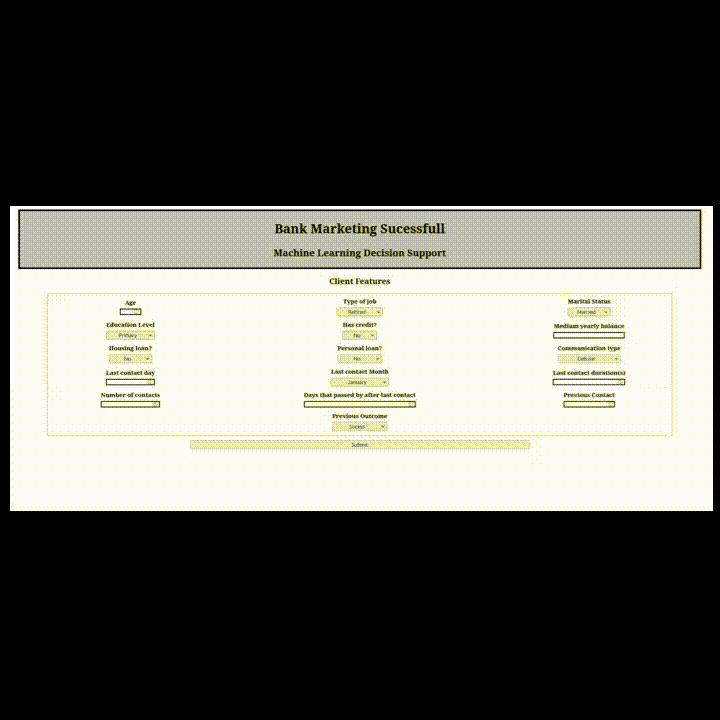

# Bank Marketing Prediction - Python,FastAPI,HTML,CSS, Javascript

## Preview

## Introduction 

Marketing campaigns are useful to attract new customers and offer new services to old clients. However, they may be expensive and don't yield the expected profit, which is frustrating.

To solve this issue, machine learning trained with historical data might help create campaigns tailored to specific clients and prevent loss of money.

This project uses a public dataset to show how it can be useful in practice.

## Data Dictionary
| Variable Name | Role    | Type         | Demographic      | Description                                                                                                                                                                                                                                     | Units | Missing Values |
|---------------|---------|--------------|------------------|-------------------------------------------------------------------------------------------------------------------------------------------------------------------------------------------------------------------------------------------------|-------|----------------|
| age           | Feature | Integer      | Age              |                                                                                                                                                                                                                                                 |       | no             |
| job           | Feature | Categorical  | Occupation       | type of job (categorical: 'admin.', 'blue-collar', 'entrepreneur', 'housemaid', 'management', 'retired', 'self-employed', 'services', 'student', 'technician', 'unemployed', 'unknown')                                                          |       | no             |
| marital       | Feature | Categorical  | Marital Status   | marital status (categorical: 'divorced', 'married', 'single', 'unknown'; note: 'divorced' means divorced or widowed)                                                                                                                            |       | no             |
| education     | Feature | Categorical  | Education Level  | (categorical: 'basic.4y', 'basic.6y', 'basic.9y', 'high.school', 'illiterate', 'professional.course', 'university.degree', 'unknown')                                                                                                           |       | no             |
| default       | Feature | Binary       |                  | has credit in default?                                                                                                                                                                                                                         |       | no             |
| balance       | Feature | Integer      |                  | average yearly balance                                                                                                                                                                                                                         | euros | no             |
| housing       | Feature | Binary       |                  | has housing loan?                                                                                                                                                                                                                              |       | no             |
| loan          | Feature | Binary       |                  | has personal loan?                                                                                                                                                                                                                             |       | no             |
| contact       | Feature | Categorical  |                  | contact communication type (categorical: 'cellular', 'telephone')                                                                                                                                                                              |       | yes            |
| day_of_week   | Feature | Date         |                  | last contact day of the week                                                                                                                                                                                                                   |       | no             |
| month         | Feature | Date         |                  | last contact month of year (categorical: 'jan', 'feb', 'mar', ..., 'nov', 'dec')                                                                                                                                                               |       | no             |
| duration      | Feature | Integer      |                  | last contact duration, in seconds (numeric). Important note: this attribute highly affects the output target (e.g., if duration=0 then y='no'). Yet, the duration is not known before a call is performed. This input should be used cautiously. |       | no             |
| campaign      | Feature | Integer      |                  | number of contacts performed during this campaign and for this client (numeric, includes last contact)                                                                                                                                          |       | no             |
| pdays         | Feature | Integer      |                  | number of days that passed by after the client was last contacted from a previous campaign (numeric; -1 means client was not previously contacted)                                                                                              |       | yes            |
| previous      | Feature | Integer      |                  | number of contacts performed before this campaign and for this client                                                                                                                                                                          |       | no             |
| poutcome      | Feature | Categorical  |                  | outcome of the previous marketing campaign (categorical: 'failure', 'nonexistent', 'success')                                                                                                                                                  |       | yes            |
| y             | Target  | Binary       |                  | has the client subscribed a term deposit?                                                                                                                                                                                                      |       | no             |

## Algorithm and Parameters
| Parameter      | Value  |
|---------------|--------|
| Algorithm     | XGBClassifier |
| random_state  | 42     |
| n_estimators  | 256    |
| learning_rate | 0.05   |

## Performance Metrics
| Metric                    | Value  |
|---------------------------|--------|
| Test AUC Score           | 0.8053 |
| Test Precision Score (1) | 0.5777 |
| Test Precision Score (0) | 0.9538 |
| Testing Accuracy Score   | 0.8989 |